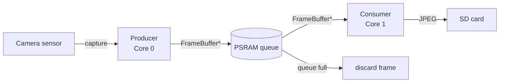

# ESP32-cam dashcam
## based on FreeRTOS

Plug it into power and it'll start snapping pictures

Two FreeRTOS tasks run on separate cores — one captures, one saves. Queue depth is calculated at boot from available PSRAM so it adapts to your board automatically.

## example

<video src="output.mp4" controls width="600"></video>

## this is a skeleton, it does not:
- check if SD is full
- rotate recordings
- stitch video

You can add more functions to the runners, or you can use it as is.

## dependencies
https://github.com/avisha95/AViShaESPCam

- check the above for configuring the camera
